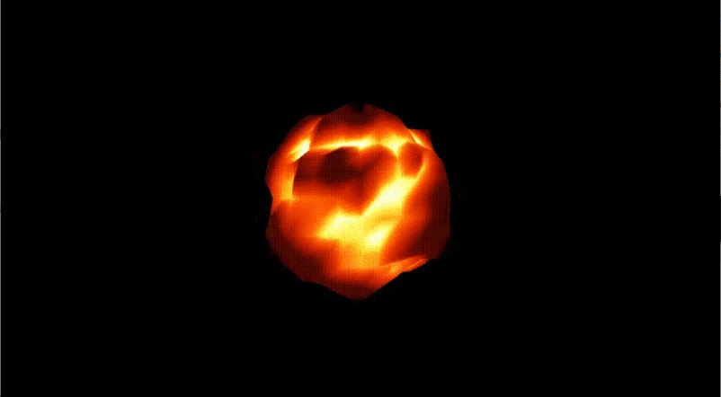
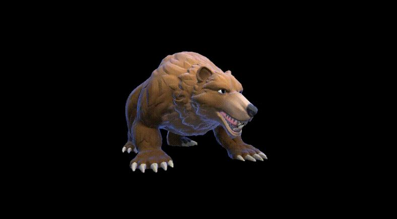
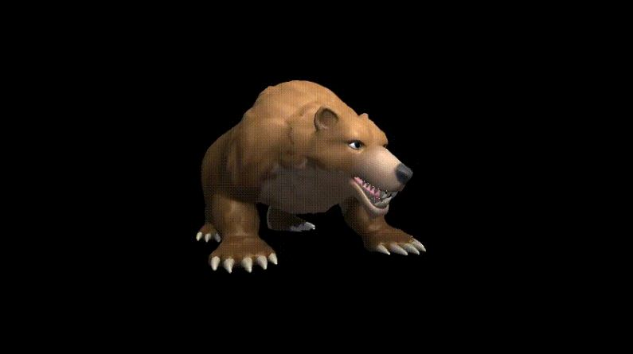
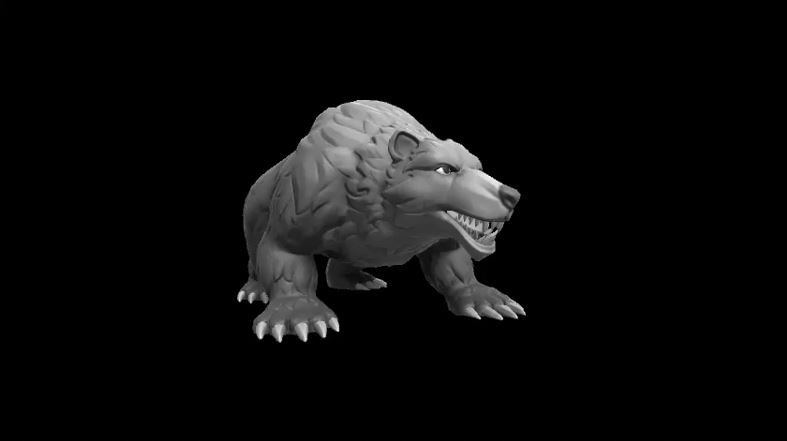
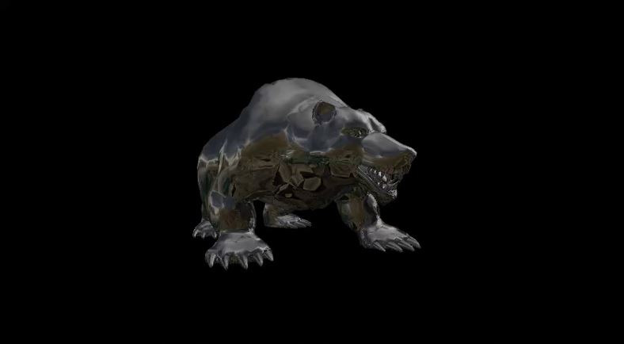

<!-- PROJECT LOGO -->
 

<h3 align="center">CODE SAMPLES</h3>

  

    SURYAPRAKASH HALWASIA
     
    <strong>This is for the University of Utah-Technical Art Track</strong>
     
    

<!-- UNITY SHADERS -->
## Unity Shaders

The following shaders created using the shader language are provided which can be used in Unity Engine:

 

#### 1. Fireball Shader
This shader utilizes a noise to create turbulence and displace the vertices to create an animated
fireball effect.

 
  
  

#### 2. Fresnel Shader
This shader implements the fresnel effect over an object along with properties to adjust the rim effect.

 
  

#### 3. Blinn Phong Shader
This shader implements the Blinn Phong lighting model.
 
  

#### 4. Grayscale Post Processing Effect shader
This shader generates a grayscale effect which can be used in post-processing.
 
  

#### 5. Glass Shader
This shader applies a glass-like surface effect on the object.
 
  

